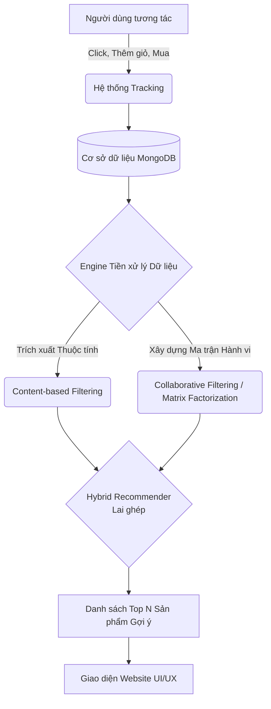
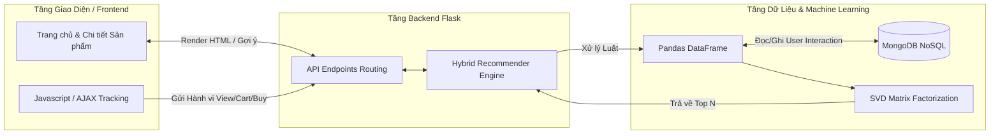

# Đề Cương Tổng Quan: Hệ Thống Website Bán Hàng Điện Tử TMĐT Có Tích Hợp Gợi Ý Cá Nhân Hóa

## 1. Giới thiệu
### Bối cảnh
Trong kỷ nguyên số, thương mại điện tử (TMĐT) đang phát triển bùng nổ. Số lượng sản phẩm trên các website mua sắm, đặc biệt là các thiết bị điện tử như điện thoại di động, ngày càng trở nên khổng lồ. Điều này đòi hỏi các website phải thông minh hơn để giữ chân khách hàng.

### Vấn đề
Sự bùng nổ thông tin dẫn đến hiện tượng "quá tải sự lựa chọn" (Information Overload). Khách hàng gặp khó khăn trong việc tìm kiếm sản phẩm phù hợp với nhu cầu và sở thích cá nhân giữa hàng ngàn sản phẩm. Việc phải tìm kiếm thủ công làm giảm tỷ lệ chuyển đổi (Conversion Rate) và ảnh hưởng xấu đến trải nghiệm người dùng.

### Giải pháp
Xây dựng một hệ thống website TMĐT bán điện thoại di động có tích hợp **Hệ thống gợi ý cá nhân hóa (Personalized Recommendation System)**. Hệ thống sẽ theo dõi hành vi của người dùng, học hỏi sở thích ngầm và tự động đề xuất những sản phẩm phù hợp nhất, giúp người dùng tiết kiệm thời gian và tăng doanh thu chéo cho cửa hàng.

---

## 2. Giải pháp Hệ thống website bán hàng điện tử TMĐT gợi ý cá nhân hóa

### 2.1 Ví dụ minh họa thực tế (Kịch bản)
- **Kịch bản 1 (Phương pháp Lọc dựa trên nội dung - Content-based):** 
  *Hành vi:* Khách hàng A truy cập vào trang chi tiết của chiếc "Samsung Galaxy S24 Ultra" (hãng Samsung, giá cao, có giảm giá).
  *Phản hồi hệ thống:* Thuật toán phân tích các đặc trưng của sản phẩm và lập tức gợi ý các sản phẩm có độ tương đồng cao ở mục "Sản phẩm tương tự", ví dụ như "Samsung Galaxy S23 Ultra" hoặc các mẫu điện thoại Android cao cấp khác dựa trên thang điểm (cùng hãng, khoảng cách giá gần nhau).
  
- **Kịch bản 2 (Phương pháp Lọc cộng tác / Matrix Factorization - Collaborative Filtering):** 
  *Hành vi:* Khách hàng B thêm "iPhone 15 Pro" vào giỏ hàng và xem "Tai nghe AirPods Pro".
  *Phản hồi hệ thống:* Thuật toán nhận thấy có một nhóm người dùng trước đây có chung hành vi với B (cùng mua iPhone 15 Pro) thường quyết định chốt đơn thêm "Củ sạc nhanh Apple 20W". Hệ thống sẽ gợi ý "Củ sạc nhanh Apple 20W" cho B ở trang chủ dưới mục "Gợi ý dành riêng cho bạn", dù B chưa từng tìm kiếm củ sạc.

### 2.2 Mô hình trực quan luồng hoạt động

### 2.3 So sánh trực quan trước và sau khi có hệ thống gợi ý
| Tiêu chí | Trước khi có Hệ thống gợi ý | Sau khi tích hợp Hệ thống gợi ý |
| :--- | :--- | :--- |
| **Trải nghiệm tìm kiếm** | Khách hàng phải tự định hướng, tìm kiếm thủ công qua thanh công cụ hoặc bộ lọc. | Sản phẩm phù hợp tự động xuất hiện ngay ở Trang chủ và Trang chi tiết. |
| **Bố cục hiển thị (UI)** | Cứng ngắc, mọi khách hàng đều thấy danh sách sản phẩm giống hệt nhau. | Động (Dynamic), giao diện được cá nhân hóa theo từng tài khoản và hành vi. |
| **Tỷ lệ chuyển đổi (CR)** | Dễ rời bỏ trang (Bounce Rate cao) do không tìm thấy đồ ưng ý. | Khả năng chốt đơn chéo (Cross-selling) và bán thêm (Up-selling) tăng mạnh. |

---

## 3. Chi tiết kỹ thuật: Thuật toán Matrix Factorization

### 3.1 Ý tưởng cốt lõi
**Matrix Factorization (Phân rã ma trận)** là một kỹ thuật mạnh mẽ nhất thuộc nhóm Lọc cộng tác (Collaborative Filtering). Ý tưởng cốt lõi là giải quyết vấn đề ma trận thưa thớt (Sparse Matrix) – khi hầu hết người dùng chỉ tương tác với một số rất ít sản phẩm.

Thuật toán tiến hành phân rã Ma trận tương tác Người dùng - Sản phẩm $R$ (kích thước $U \times I$) thành tích của hai ma trận có số chiều nhỏ hơn: 
- Ma trận đặc trưng ẩn của người dùng $P$ (kích thước $U \times K$)
- Ma trận đặc trưng ẩn của sản phẩm $Q$ (kích thước $I \times K$)
*(Trong đó $K$ là số lượng các đặc trưng ẩn - Latent Features).*

Mức độ quan tâm của người dùng $u$ đối với sản phẩm $i$ chưa từng tương tác được dự đoán bằng tích vô hướng của hai vector: 
$$\hat{r}_{ui} = p_u \cdot q_i^T$$

### 3.2 Ví dụ trực quan
Giả sử có ma trận tương tác (View=1, Cart=3, Mua=5) giữa 3 Khách hàng và 4 Điện thoại. Ma trận này có rất nhiều ô trống.
Thuật toán SVD phân rã nó và tự động học ra $K=2$ đặc trưng ẩn (Ví dụ giả định: Đặc trưng 1 = "Thích chụp ảnh", Đặc trưng 2 = "Thích chơi game").
- Nếu Vector của Khách hàng A biểu hiện điểm cao ở "Thích chụp ảnh".
- Vector của Điện thoại X (iPhone 15 Pro) biểu hiện điểm cao ở "Thích chụp ảnh".
-> Tích vô hướng sẽ cho ra một điểm dự đoán cực kỳ cao. Hệ thống lập tức điền điểm dự đoán này vào ô trống ban đầu và quyết định gợi ý Điện thoại X cho Khách hàng A để kích thích mua hàng.

### 3.3 Quy trình thực hiện
1. **Thu thập dữ liệu (Tracking):** Ghi nhận lịch sử (View, Cart, Purchase) và lưu vào MongoDB.
2. **Tiền xử lý (Preprocessing):** Chuyển đổi dữ liệu thô thành DataFrame (`pandas`), lượng hóa các hành vi thành điểm số (Rating/Weight).
3. **Huấn luyện mô hình (Training):** Sử dụng các thuật toán như SVD (Singular Value Decomposition) để tối thiểu hóa hàm mất mát (Loss Function) bằng Gradient Descent hoặc ALS.
4. **Dự đoán (Prediction):** Tính toán điểm số $\hat{r}_{ui}$ dự đoán cho tất cả các sản phẩm mà người dùng chưa tương tác.
5. **Đề xuất (Recommendation):** Sắp xếp và trả về danh sách Top N sản phẩm có điểm dự đoán cao nhất.

---

## 4. Đánh giá hệ thống
Hệ thống AI được đánh giá và đo lường thông qua các chỉ số Machine Learning tiêu chuẩn:
- **RMSE (Root Mean Square Error) & MAE (Mean Absolute Error):** Đánh giá mức độ sai lệch giữa điểm dự đoán của thuật toán SVD và sở thích thực tế của người dùng. Chỉ số càng nhỏ, độ chính xác càng cao.
- **Precision@K & Recall@K:** Đánh giá chất lượng của danh sách gợi ý. Đo lường xem trong Top K sản phẩm được đề xuất, có bao nhiêu sản phẩm thực sự hữu ích và khiến người dùng click/mua.
- **Tốc độ phản hồi (Latency):** Việc sử dụng Matrix Factorization yêu cầu tính toán trước (offline training). Thời gian gọi API gợi ý trực tuyến phải dưới 200ms để đảm bảo UI/UX mượt mà.

---

## 5. Công cụ thực hiện dự án
- **Ngôn ngữ lập trình:** Python (Backend) và JavaScript/HTML/CSS (Frontend).
- **Thư viện Machine Learning:** `scikit-surprise` (hỗ trợ trực tiếp SVD, KNN cho hệ thống gợi ý).
- **Xử lý Dữ liệu:** Thư viện `pandas` và `numpy` (Dùng để thao tác ma trận, tính toán vector).
- **Cơ sở dữ liệu:** MongoDB (NoSQL) quản lý qua `MongoEngine`. Phù hợp tuyệt đối để lưu trữ dữ liệu hành vi phi cấu trúc của hàng ngàn người dùng.
- **Framework Web Backend:** Flask (Kiến trúc Blueprint chia module, xử lý REST API).
- **Phương pháp Triển khai:** Triển khai trên nền tảng Cloud (Render) hoặc chạy local thông qua Virtual Environment.

---

## 6. Mô hình kiến trúc kỹ thuật

